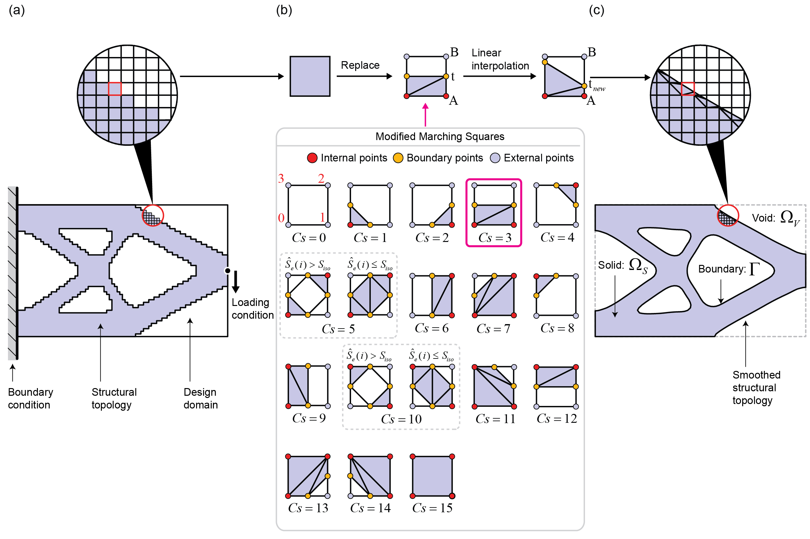
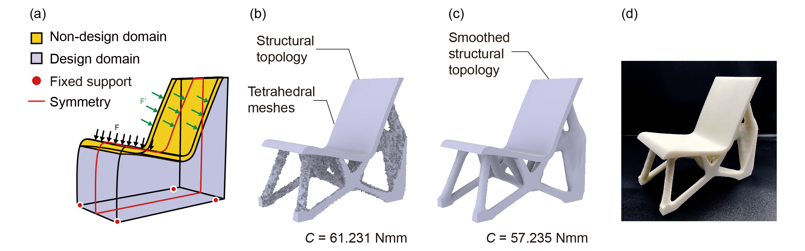
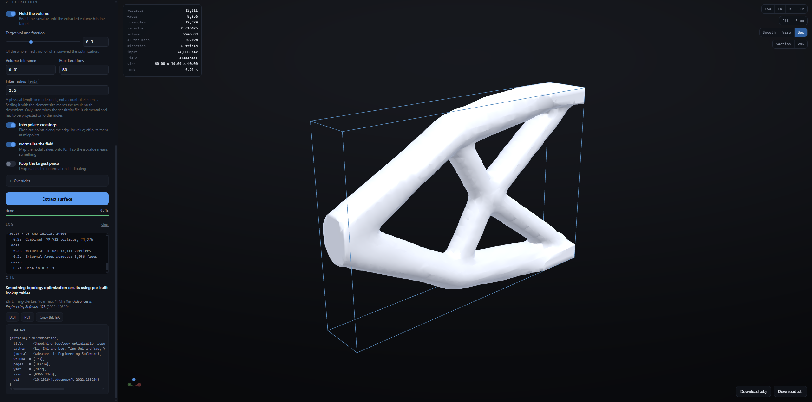

# PLTP



*Each cell contributes the closed polygon of its solid part, not just the cut line. In three dimensions the same idea gives 256 hexahedral cases. (Fig. 2 of the paper.)*

PLTP converts a finished BESO topology optimization result into a **watertight triangulated solid**.

It takes a finite element mesh (hexahedral or tetrahedral) together with a nodal sensitivity field and
extracts the iso-sensitivity model as an `.obj`. Unlike a plain marching-cubes isosurface, every
element contributes a **closed polyhedron of its solid part**, so the output is a manifold solid ready
for rendering, boolean operations or 3D printing rather than a bare surface.

PLTP is the post-processing companion to the [TOPX](https://github.com/AlbertLiDesign/TOPX)
optimizer: it reads TOPX's `beso.txt` model file and its `ndl_sen_<k>.txt` nodal sensitivity output
directly. Abaqus `.inp` meshes are supported as well.



*A tetrahedral BESO result before and after extraction, and printed. Smoothing the boundary also lowered the compliance, 61.231 to 57.235 Nmm. (Fig. 9 of the paper.)*

---

## Table of Contents

- [Citation](#citation)
- [Web App](#web-app)
- [Pipeline](#pipeline)
- [Requirements and Build](#requirements-and-build)
- [Usage](#usage)
- [Parameters](#parameters)
- [How Extraction Works](#how-extraction-works)
- [Input Formats](#input-formats)
- [Project Layout](#project-layout)
- [Sample Data](#sample-data)
- [Known Limitations](#known-limitations)

---

## Citation

The method PLTP implements is published as:

> Zhi Li, Ting-Uei Lee, Yuan Yao, Yi Min Xie.
> **Smoothing topology optimization results using pre-built lookup tables.**
> *Advances in Engineering Software* **173** (2022) 103204.
> [doi:10.1016/j.advengsoft.2022.103204](https://doi.org/10.1016/j.advengsoft.2022.103204)

A copy is in [`paper/`](paper/), and the two figures above are Fig. 2 and Fig. 9 of it.
If this code is useful in your work, please cite it.

```bibtex
@article{li2022smoothing,
  title   = {Smoothing topology optimization results using pre-built lookup tables},
  author  = {Li, Zhi and Lee, Ting-Uei and Yao, Yuan and Xie, Yi Min},
  journal = {Advances in Engineering Software},
  volume  = {173},
  pages   = {103204},
  year    = {2022},
  issn    = {0965-9978},
  doi     = {10.1016/j.advengsoft.2022.103204}
}
```

---

## Web App

`PLTP.Web` is an interactive front end for the same library: load a model and its sensitivity
field, set the parameters, watch the extraction run, turn the result around in 3D and download
the `.obj` or `.stl`. It is a local tool — it runs on your machine and reads your files from
there.



*The cantilever sample: parameters on the left, the extracted surface in the middle, and what it
actually came out as - vertices, faces, the isovalue the volume bisection settled at, and the
volume fraction it reached.*

```bash
./run-web.sh          # Linux, macOS      →  http://localhost:5080
```
```powershell
.\run-web.ps1         # Windows
```

Both scripts build, start the server and open a browser. Or drive `dotnet` yourself:

```bash
dotnet run --project PLTP.Web -c Release --urls http://localhost:5080
```

**Requirements: the .NET 8 SDK or newer, and nothing else.** No npm install, no CDN, no network
at run time — the viewer is hand-written WebGL2 with no third-party JavaScript, so a fresh clone
works offline.

The seven cases in `data/` appear as one-click samples, each carrying its own filter radius,
because that radius is a physical length belonging to the mesh rather than a setting that
transfers between them.

### What the browser gives you that the library does not

- **Detection, reported.** Format, element type and whether the sensitivity field is per element
  or per node are worked out from the files and written to the log before anything runs. The
  readers match on row prefixes and fail *silently* on the wrong format, so this is the
  difference between a clear error and a puzzle. All three can be overridden.
- **The volume bisection, live.** Every trial prints its isovalue and the volume fraction it
  produced, so a search that saturates short of the target is visible while it happens rather
  than inferred afterwards. Long runs can be cancelled.
- **A normalisation switch.** The isovalue lives on `[0, 1]`, but a raw solver field does not —
  LetterA's runs around `1e-11`. The hexahedral path always min-maxed the field inside
  `SortVerts` and the tetrahedral path never did; here both do, on one switch, and the range it
  mapped from goes in the log.
- **The surface itself.** Orbit, section along any axis, flat or smooth shading, the
  triangulation, a bounding box, PNG capture — plus vertex, face, achieved-volume and
  achieved-isovalue counts. That last one is worth having: it is the isovalue you would pass by
  hand to reproduce the run without the bisection.

### API

The browser talks to a small JSON API, which is also usable directly:

| | |
|---|---|
| `GET /api/samples` | the cases found in `data/` |
| `POST /api/jobs` | multipart: `model` + `sensitivity` files, or `sample=<id>`, plus the parameters |
| `GET /api/jobs/{id}?since=<n>` | state, progress and log lines after the first `n` |
| `POST /api/jobs/{id}/cancel` | stop a running extraction |
| `GET /api/jobs/{id}/mesh` | the surface as packed float32 positions and uint32 indices |
| `GET /api/jobs/{id}/download/{obj\|stl}` | the finished file |

Jobs run one at a time — extraction is already parallel inside, and a large model peaks near
10 GB, so two at once would contend for the same cores and could take the process out on memory.
The six most recent results stay in memory; older ones are evicted.

---

## Pipeline

```
FE mesh + nodal sensitivity field
        │
        ├─ Import.ReadHex_ALFE / ReadTet_ALFE      (TOPX beso.txt)
        │  Import.ReadHex_Abaqus / ReadTet_Abaqus  (Abaqus .inp)
        │  Import.ReadSenNum                       (one value per line)
        ↓
   HexModel / TetraModel
        │
        ├─ SortVerts()                  canonical corner ordering (hex only)
        ├─ AdjustSenNum(isovalue)       force solid / void domains
        ├─ ExtractIsoSensitivityModel() per-element closed polyhedra,
        │                               optionally bisecting the isovalue
        │                               until the target volume is met
        ↓
   one Mesh per element
        │
        ├─ Mesh.CombineMeshes
        ├─ weld vertices
        ├─ RemoveDuplicatedFaces        drops the internal shared faces
        ↓
   Export.WriteObj  →  .obj
```

---

## Requirements and Build

- **.NET 7.0**, `AnyCPU` / `x64`
- `PLTP/Dependencies/KDTree.dll` — a managed assembly, referenced locally

No native dependency and no external NuGet package, so it builds and runs on any platform.

```bash
dotnet build PLTP/PLTP.csproj -c Release
dotnet run   --project PLTP -c Release
```

---

## Usage

`Program.Main` currently calls `TestModel()`, which contains **hardcoded absolute paths**. Point it at
your own files before running:

```csharp
public static void TestModel()
{
    string mdl_path    = "../../../../../data/LetterA/beso.txt";
    string sen_path    = "../../../../../data/LetterA/elem_sen_113.txt";
    string output_path = "../../../../../data/LetterA/Smoothing.obj";

    Test.TestHex(mdl_path, sen_path,
                 volumeFraction: 0.15, isovalue: 0.05, filterRadius: 3,
                 tolerance: 0.01, maximumIteration: 50,
                 interpolation: true, keepVolume: false, output_path);
}
```

`Test.cs` provides four drivers, differing in importer and mesh-cleanup strategy:

| Driver | Mesh | Model source |
|--------|------|--------------|
| `Test.TestHex` | hexahedra | TOPX `beso.txt` |
| `Test.TestTetra` | tetrahedra | TOPX `beso.txt` |
| `Test.TestTetra_Abaqus` | tetrahedra | Abaqus `.inp` |
| `Test.ObtainSensitivityMdl` | hexahedra | Abaqus `.inp` |

A full command-line front end is written but **commented out** in `Program.cs`. Restoring it gives:

```
PLTP.exe -type <true|false> -m <mdl_path> -s <sen_path> -o <output_path>
         [-v <volumeFraction>] [-r <filterRadius>] [-t <tolerance>]
         [-iso <isovalue>] [-i <maximumIteration>] [-p <interpolation>] [-k <keepVolume>]
```

`PrintHelp()` documents every switch.

---

## Parameters

| Parameter | Default | Meaning |
|-----------|---------|---------|
| `isovalue` | 0.5 | Sensitivity threshold. A node is inside the solid when its value exceeds it. Ignored when `keepVolume` is on |
| `volumeFraction` | 0.2 | Target volume fraction, used only when `keepVolume` is on |
| `keepVolume` | true | Bisect the isovalue until the extracted volume matches `volumeFraction` |
| `tolerance` | 0.01 | Volume-fraction tolerance for that bisection |
| `maximumIteration` | 50 | Cap on bisection steps |
| `interpolation` | true | Move boundary vertices to the linearly interpolated crossing. With it off, they stay at edge midpoints and the result is blockier |
| `filterRadius` | 3.0 | Filter radius carried over from the optimization |

`keepVolume` re-extracts the entire model on every bisection step, so runtime scales with the number
of iterations actually used.

---

## How Extraction Works

For each element, the nodal sensitivities are compared against the isovalue to form an 8-bit (hex) or
4-bit (tet) case flag. That flag indexes pre-built lookup tables which return, not the cut surface,
but the **whole solid polyhedron** of the element:

| Table | Contents |
|-------|----------|
| `VertTable_Hex[flag]` | every vertex of the polyhedron — interior corners and edge crossings |
| `FaceTable_Hex[flag]` | its faces, triangles or quads |
| `ActiveTable_Hex[flag]` | which vertices are edge crossings and may therefore be moved |
| `ConnectionTable_Hex`, `EdgeFlags_Hex` | the classic marching-cubes tri table and edge mask, used to compute where the crossings land |

With `interpolation` enabled, the active vertices are then moved onto the linearly interpolated
crossing points. An element whose nodes are all inside (`flag == 255`) skips the tables and emits the
complete hexahedron.

Because each cell yields a closed solid, adjacent solid cells share coincident internal faces.
`RemoveDuplicatedFaces` deletes those pairs and leaves only the outer boundary — it is part of the
algorithm, not optional cleanup.

Solid and void domains are enforced geometrically by `AdjustSenNum`, which runs before every
extraction: nodes of solid elements are raised to `isovalue * 1.1` and nodes of void elements dropped
to `0`, so they always fall on the intended side of the threshold.

---

## Input Formats

**Model** — TOPX / ALFE `beso.txt`, comma-separated rows:

```
N,x,y,z            node
E,n0,n1,...        element (8 indices for hexahedra, 4 for tetrahedra)
SD,id              solid-domain element
VD,id              void-domain element
```

Only these prefixes are parsed; the header block is skipped. Abaqus `.inp` files are read through the
`*Node` / `*Element` blocks instead.

**Sensitivity** — one floating-point value per line, in node order (or element order when using
`CalNdlSenNums` to average onto nodes). This matches TOPX's `ndl_sen_<k>.txt` and `elem_sen_<k>.txt`.

**Output** — Wavefront `.obj`, written by `Export.WriteObj`.

---

## Project Layout

```
PLTP/
├── Program.cs               entry point; the CLI front end is present but commented out
├── Test/
│   ├── Test.cs              the four end-to-end drivers
│   └── MCCTest.cs           lookup-table experiments
├── FiniteElement/
│   ├── HexModel.cs          hexahedral extraction, volume-preserving search
│   └── TetraModel.cs        tetrahedral extraction (cases hardcoded inline)
├── Geometry/
│   ├── Mesh.cs              vertices/faces, weld, dedupe, volume, triangulation
│   ├── Hexahedron.cs        8-node cell with its nodal sensitivities
│   ├── Tetrahedron.cs       4-node cell
│   └── Quadrangle.cs, Face.cs, Box.cs, Vector.cs
├── IO/
│   ├── Import.cs            ALFE / Abaqus / MCC readers, sensitivity reader
│   └── Export.cs            .obj writer
├── Utils/
│   ├── Table.cs             the 256-case hexahedral lookup tables
│   └── Utils.cs             KD-tree search, mesh welding
└── Dependencies/KDTree.dll

PLTP.Web/
├── Program.cs               the JSON API and the static file host
├── Services/
│   ├── PltpRunner.cs        the pipeline, with progress reporting and detection
│   ├── Sniff.cs             format and element type from the file itself
│   ├── JobStore.cs          one extraction at a time, with cancellation
│   ├── MeshBinary.cs        the packed mesh the viewer downloads
│   └── SampleCatalog.cs     the cases in data/, with per-mesh defaults
└── wwwroot/
    ├── index.html, css/app.css
    └── js/viewer.js         hand-written WebGL2 - no third-party JavaScript
        js/app.js
```

---

## Sample Data

`data/` holds two complete cases, each a model plus its sensitivity field. Both appear as
one-click samples in the web app.

| Case | Elements | Format |
|------|----------|--------|
| `LetterA` | 80,000 hexahedra | TOPX `beso.txt` + `elem_sen_113.txt` |
| `Cantilever` | 24,000 hexahedra | Abaqus `.inp` + `Sensitivities.txt` |

Both are hexahedral. The tetrahedral sets that used to sit here were dropped for their weight —
`tetra_3` alone was 18 MB. The tetrahedral path is fully supported and separately implemented
(see [Known Limitations](#known-limitations)); it just needs a model of your own, through the
upload tab or `Test.TestTetra`.

---

## Known Limitations

- **Hexahedral tables assume a regular grid.** `Size` scales the table coordinates back to world
  space, so a non-uniform hexahedral mesh will not extract correctly.
- **There are no tetrahedral lookup tables.** `Table.cs` covers hexahedra only; `TetraModel` hardcodes
  its cases inline in `IsoSenMdl_Tetra`. The two paths must be maintained separately.
- **`SD,` / `VD,` indices are parsed as 1-based** (`int.Parse(tokens[1]) - 1`), while TOPX writes them
  from 0-based element IDs. Domains imported from TOPX would be shifted by one. No sample case in
  `data/` has a non-empty solid or void domain, so this path is untested.
- **The command line is not wired up**; `Main` runs `TestModel()` with hardcoded paths. Use
  `PLTP.Web` for an interactive run, or restore the commented-out `Main` for a scripted one.
- **Two different welders** are in use — `MeshWeld.Weld` (tetrahedral drivers) and
  `Mesh.WeldVertices` (`TestHex`) — with tolerances from `1e-4` to `1e-10`. They are not interchangeable.
- **`Utils.cs` contains decompiled code**: `MeshWeld` is supported by `Class18` / `Class19` / `Class20`,
  machine-generated names implementing the spatial hashing used for welding.
